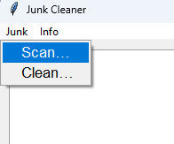
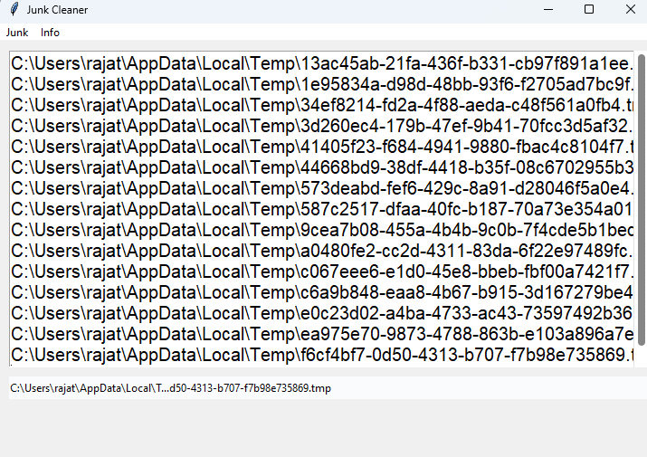
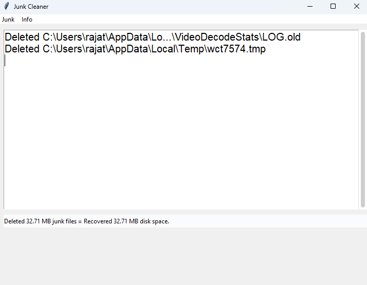

## Disk Cleaner for Windows [](https://www.python.org/) [](https://pypi.org/project/pip) [](https://github.com/Naereen/StrapDown.js/blob/master/LICENSE)

#### A <12 KB sized utility to clean trash from your `C:/` drive in Windows.

### Run

- Setup python virtual environment:

```console
$ python -m venv .virtual_env_name
```

- Activate venv:

```console
$ source .venv/bin/activate
```

- Install dependencies in virtual env:

```console
$ python -m pip install requirements.txt
```

> Note: Or you can install dependencies manually using `pip install package_name` if you encounter any repository-related error.

- Run the `src/main.py` and scan for junk before proceeding to clean it (ofc).

### Interface

- Choosing an option:

<div align="center">
    
</div><br>

- Analysing junk...
<div align="center">
    
</div><br>

- Cleaning junk...
<div align="center">
    
</div>
